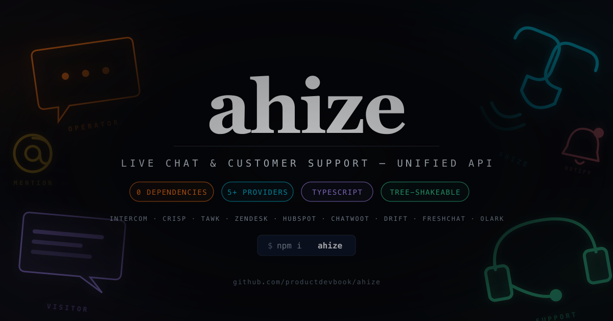

<p align="center">
  <br>
  
  <br><br>
  <b style="font-size: 2em;">ahize</b>
  <br><br>
  Zero-dependency TypeScript wrappers for live chat & customer support widgets.
  <br>
  Unified API over Intercom, Crisp, Tawk.to, Zendesk, HubSpot and more. Tree-shakeable, SSR-safe.
  <br><br>
  <a href="https://npmjs.com/package/ahize"></a>
  <a href="https://npmjs.com/package/ahize"></a>
  <a href="https://bundlephobia.com/result?p=ahize"></a>
  <a href="https://github.com/productdevbook/ahize/blob/main/LICENSE"></a>
</p>

> [!IMPORTANT]
> **Planned providers:** Intercom, Crisp, Tawk.to, Zendesk, HubSpot, Drift, Freshchat, LiveChat, Olark, Userlike, HelpScout Beacon, Smartsupp — all exposed through a single surface (`load` / `identify` / `track` / `show` / `hide` / `shutdown`).
>
> **Contributions welcome!** Missing a provider? [Open an issue](https://github.com/productdevbook/ahize/issues) or send a PR.

## Quick Start

```sh
npm install ahize
```

```ts
import { load, identify, track, show } from "ahize/intercom";

await load({ appId: "abc123" });
identify({ id: "user_1", email: "ada@example.com" });
track("plan_upgraded", { tier: "pro" });
show();
```

Every provider exposes the same surface:

```ts
load(options);                 // inject CDN & boot
identify(visitor);             // set user profile
track(event, metadata?);       // emit a custom event
show();  hide();               // toggle widget
shutdown();                    // end session / log out
```

## Providers

| Provider   | Import path        | Status      |
| ---------- | ------------------ | ----------- |
| Intercom   | `ahize/intercom`   | scaffolded  |
| Crisp      | `ahize/crisp`      | scaffolded  |
| Tawk.to    | `ahize/tawk`       | scaffolded  |
| Zendesk    | `ahize/zendesk`    | scaffolded  |
| HubSpot    | `ahize/hubspot`    | scaffolded  |
| Chatwoot   | `ahize/chatwoot`   | scaffolded  |
| Drift      | `ahize/drift`      | planned     |
| Freshchat  | `ahize/freshchat`  | planned     |
| LiveChat   | `ahize/livechat`   | planned     |
| Olark      | `ahize/olark`      | planned     |
| Userlike   | `ahize/userlike`   | planned     |
| HelpScout  | `ahize/helpscout`  | planned     |
| Smartsupp  | `ahize/smartsupp`  | planned     |

## Why

- 🔌 **Unified API** — swap providers without rewriting app code.
- 📦 **Zero runtime dependencies.**
- 🌲 **Tree-shakeable** — only the provider you import ships.
- 🧩 **Sub-path exports** — `ahize/intercom`, `ahize/crisp`, …
- 💪 **Pure TypeScript**, strict types.
- 🌍 **SSR-safe** — every call is a no-op when `window` is undefined.

## SSR

Functions no-op when `window`/`document` isn't available, so it's safe to call
from Next.js, Nuxt, Remix, SvelteKit, Astro, etc.

## License

[MIT](./LICENSE) © [productdevbook](https://github.com/productdevbook)
